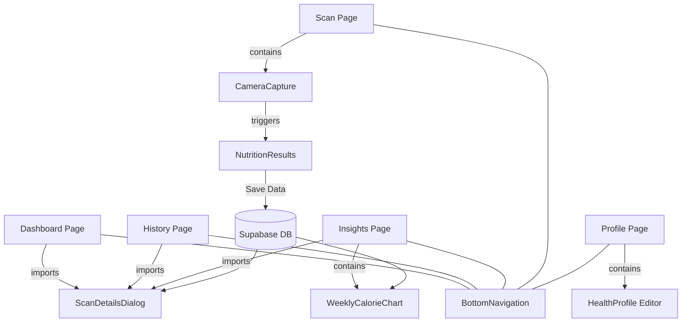

# 🥗 Nutri-scan: AI-Powered Nutrition Intelligence

[](https://vercel.com)
[](https://nextjs.org/)
[](https://supabase.com/)
[](https://uxdesign.cc/neumorphism-in-user-interfaces-b4c303ee3516)

**Nutri-scan** is a state-of-the-art health application that transforms how you track nutrition. Using advanced AI image recognition, it decodes food images into actionable health data, providing personalized insights tailored to your unique biological profile.

---

## ✨ Key Features

### 📸 Intelligent Food Scanning
Snap a photo or upload an image. Our backend AI identifies ingredients and calculates precise nutritional values in seconds.

### 🧬 Personalized Health Impact
Go beyond generic data. Define your health conditions (e.g., *Diabetic*, *Hypertension*) in your profile, and Nutri-scan will alert you to ingredients that specifically affect **you**.

### 📊 Health Insights & Trends
Visualize your progress with dynamic Neumorphic charts. Track your weekly calorie intake and monitor your health score distribution.

### 📂 Unified History
Access all your past scans in one place. No more page jumps—our unified **ScanDetailsDialog** allows you to view full reports instantly across all major pages.

### 🎨 Premium Neumorphic UI
A bespoke design language featuring a calming light-mint palette (`#eaf0eb`), soft shadows, and heavy rounded corners for a premium, modern feel.

---

## 🏗️ Project Architecture

### 📁 Directory Structure
```text
Nutri-scan/
├── app/                  # Next.js App Router Pages
│   ├── auth/             # Authentication flow (Login, Sign-up, Reset)
│   ├── dashboard/        # Main overview & activity metrics
│   ├── history/          # Chronological scan log
│   ├── insights/         # Data visualization & trends
│   ├── profile/          # User health profile & settings
│   └── scan/             # The core AI scanning interface
├── components/           # Reusable UI & Business Logic
│   ├── ui/               # Base shadcn/radix components
│   └── scan-details-dialog.tsx # Unified Detail View
├── backend/              # Python/FastAPI AI Processing
├── lib/                  # Shared utilities & Supabase clients
├── public/               # Static assets & Brand identity
└── scripts/              # Database migration & seeding SQL
```

### 🔗 Component Connectivity Map

The following diagram illustrates the flow from data acquisition to visualization, highlighting the central role of the `ScanDetailsDialog`.



### 📋 Component Registry & Usage

| Component | Responsibility | Used In |
|:--- |:--- |:--- |
| **`ScanDetailsDialog`** | Unified pop-up for detailed food analysis and deletion. | Dashboard, History, Insights |
| **`NutritionResults`** | Displays real-time AI analysis after a fresh scan. | Scan Page |
| **`BottomNavigation`** | Primary app navigation with Neumorphic styling. | All Main Pages |
| **`CameraCapture`** | Interface for photo taking and image uploading. | Scan Page, Guest Scan |
| **`WeeklyCalorieChart`** | Visual trend analysis of caloric intake. | Insights Page |
| **`HealthScoreDistribution`** | Breakdown of food quality grades. | Insights Page |

---

## 🛠️ Technical Implementation

- **Frontend**: [Next.js](https://nextjs.org/) (App Router), [React 19](https://react.dev/), [Tailwind CSS 4](https://tailwindcss.com/).
- **Database & Auth**: [Supabase](https://supabase.com/).
- **Visuals**: [Lucide React](https://lucide.dev/), [Recharts](https://recharts.org/).
- **Deployment**: [Vercel](https://vercel.com).
- **Quality**: TypeScript 5.x for strict type safety.

---

## 🚀 Getting Started

### 1. Prerequisites
- Node.js 18+
- Supabase Account (URL & Anon Key)

### 2. Installation
```bash
git clone https://github.com/sahilshaik13/Nutri-scan.git
cd Nutri-scan
npm install
```

### 3. Environment Setup
Create a `.env.local` file in the root directory:
```env
NEXT_PUBLIC_SUPABASE_URL=your_supabase_url
NEXT_PUBLIC_SUPABASE_ANON_KEY=your_supabase_key
NEXT_PUBLIC_API_URL=your_backend_api_url
```

### 4. Running the App
```bash
npm run dev
```
The app will be available at [http://localhost:3000](http://localhost:3000).

---

## 🛡️ Security & Privacy
Nutri-scan takes data privacy seriously. All scans are secured via Supabase Row-Level Security (RLS), ensuring that your health data is visible only to you.

---

Designed with ❤️ for a healthier world.
